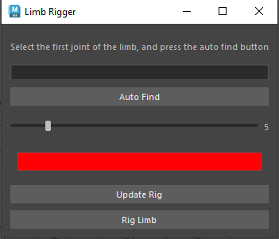

# My Maya Plugins

## Limb Rigger

[Limb Rigger]("./src/LimbRigger.py")

[Google]("https://www.google.com")

this plugin rigs any 3 joint limb with ik and fk and ikfk blend

* support auto joint finding
* controller size control
* controller color control

#proxy Generator
 A Proxy generator is the process of automation of providing a and maintaining proxy server for network requests, it also handles any errors that may come happen such as, fialed connections or invalid proxies.

 Proxy Gen with geo:

    def CreateProxyModleForJntsAndVerts(self, jnt, verts):
        if not verts:
            return None
        
        faces = mc.polyListComponentConversion(verts, fromVertex=True, toFace=True)
        faces = mc.ls(faces, fl=True)

        FaceNames = set()
        for face in faces:
            FaceNames.add(face.replace(self.model, ""))

        dup = mc.duplicate(self.model)[0]
        AllDupFaces = mc.ls(f"{dup}.f[*]", fl=True)
        facesToDelete = []
        for dupFace in AllDupFaces:
            if dupFace.replace(dup, "") not in FaceNames:
                facesToDelete.append(dupFace)

        mc.delete(facesToDelete)

        dupeName = self.model + "_" + jnt + "_proxy"
        mc.rename(dup, dupeName)
        return dupeName

Cuts the geo into seperate parts useing the clossest bone and weight mapping as a reference

Calling the Proxy Generator:

    class ProxyGeneratorWidget(MayaWindow):
        def __init__(self):
            super().__init__()
            self.generator = ProxyGenerator()
            self.masterLayout = QVBoxLayout()
            self.setLayout(self.masterLayout)

            self.masterLayout.addWidget(QLabel("Please select the rigged model, and press the buld button"))
            buildBtn = QPushButton("Build")
            self.masterLayout.addWidget(buildBtn)
            buildBtn.clicked.connect(self.generator.BuildProxyForSelectedMesh)
            self.setWindowTitle("Proxy Generator")
            
        def GetWudgetYbuqyeBane(self):
            return "ProxyGeneratorCL4152025212"

This is how we get the proxy generator to apear in the maya extention so the user can initiate a proxy Generator