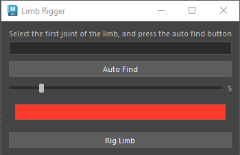

# My Maya Plugins

## Limb Rigger

[Limb Rigger]("./src/LimbRigger.py")

[Google]("https://www.google.com")

this plugin rigs any 3 joint limb with ik and fk and ikfk blend

* support auto joint finding
* controller size control
* controller color control

#proxy Generator

explain how it works
what the tool does for now
the classes, functions, and the lgoic behind the tool

'''python 

'''